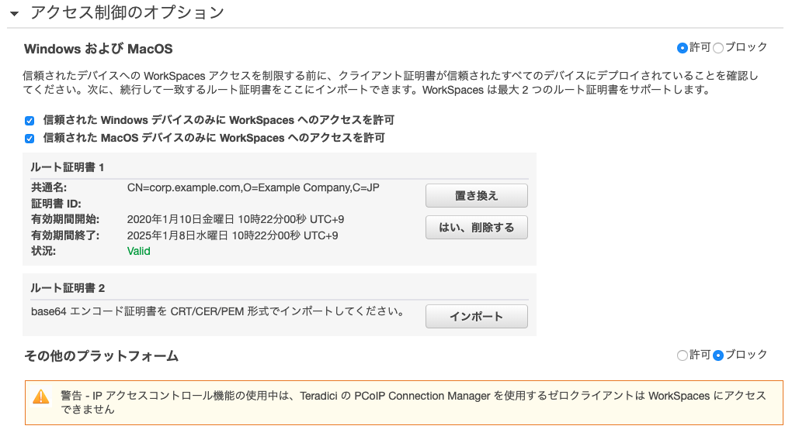

# WorkSpaces払い出し手順

## ディレクトリの作成

**（注意）CloudWatch LogsのVPCエンドポイントが存在すると、Simple ADの作成が失敗します（2020年/1月時点）。
このため、ディレクトリの作成作業前にWorkSpaces用のVPCからVPCエンドポイントを削除し、作業後に再度追加して下さい。**

以下の手順でディレクトリを作成します。

1. *サービス*から*WorkSpaces*を選択します。
1. *今すぐ始める*をクリックし、*詳細設計*を*起動*します。
1. *ディレクトリのタイプ*は*Simple AD*を選択し、*次へ*進みます。
1. *ディレクトリ情報の入力*で以下の内容を入力し、*次へ*進みます。

  |項目|設定値|備考|
  |---|---|---|
  |ディレクトリのサイズ|スモール||
  |組織名|（任意）|既に使われている名前は使用不可|
  |ディレクトリのDNS名|`corp.example.com`||
  |Adminパスワード|（任意）||
  |パスワードの確認|（任意）||

1. *ネットワーキング*で、名前に`WorkSpaces`を含むVPCと`Isolated`を含むサブネットを2つ選択し、*次へ*進みます。
1. 内容を確認し、*ディレクトリの作成*を行います。

1. ディレクトリの*ステータス*列が`Active`になるのを待ちます。

## ディレクトリの登録

1. ディレクトリにチェックし、*アクション*から*登録*をクリックします。
1. *ディレクトリの登録*画面で以下の内容を選択し、*登録*をクリックします。。

  |項目|設定値|備考|
  |---|---|---|
  |サブネット1|Isolatedサブネット|別途VPCコンソールを開いてサブネットのIDを確認して下さい|
  |サブネット2|Isolatedサブネット|別途VPCコンソールを開いてサブネットのIDを確認して下さい|
  |セルフサービスアクセス許可の有効化|いいえ||
  |Amazon WorkDocs の有効化|いいえ||

1. ディレクトリの*登録済み*列が`はい`になるのを待ちます。

## セキュリティグループの設定

1. ディレクトリにチェックし、*アクション*から*詳細の更新*をクリックします。
1. セキュリティグループを展開し、WorkSpaces用に作成済みのセキュリティグループを選択し、*更新と終了*をクリックします。

## クライアント証明書の作成

[cfssl](https://github.com/cloudflare/cfssl)を使って、オレオレ認証局と、オレオレ認証局が署名したクライアント証明書を作成します。

- [クライアント証明書の作成](client-certificates.md)

## クライアント証明書認証の設定

1. *サービス*から*WorkSpaces*を選択します。
1. 左のメニューで*ディレクトリ*を選択しします。
1. ディレクトリにチェックし、*アクション*から*詳細の更新*をクリックします。
1. *アクセス制御のオプション*を展開し、以下のように設定します。

  |項目|設定値|備考|
  |---|---|---|
  |Windows および MacOS|許可||
  |信頼された Windows デバイスのみに WorkSpaces へのアクセスを許可|チェックする||
  |信頼された MacOS デバイスのみに WorkSpaces へのアクセスを許可|チェックする||
  |その他のプラットフォーム|ブロック||

1. *ルート証明書1*の*インポート*をクリックします。
1. `ca.pem`の内容をペーストし、*インポート*をクリックします。
1. 内容を確認し、*更新と終了*をクリックします。 

## WorkSpacesの起動

1. 左のメニューで*WorkSpaces*を選択し、*WorkSpacesの起動*をクリックします。
1. *ディレクトリの選択*画面で作成したディレクトリを選択し、*次のステップ*へ進みます。
1. *ユーザーの特定*画面の上部にある*新規ユーザーを作成してディレクトリに追加します*の部分で新規ユーザーの必要事項を入力し、*ユーザーの作成*を行います。
1. 画面下部で作成したユーザーが追加されていることを確認し、*次のステップ*へ進みます。
1. *バンドルの選択*画面では以下を選択し、*次のステップ*へ進みます。

  |項目|設定値|備考|
  |---|---|---|
  |バンドル|Standard with Windows 10 and Office 2016||
  |言語|Japanese||
  
1. *WorkSpacesの設定*画面で以下の内容を選択し、*次のステップ*へ進みます。

  |項目|設定値|備考|
  |---|---|---|
  |実行モード|AutoStop||
  |自分のキーでルートボリューム の暗号化|チェックしない||
  |自分のキーでユーザーボリューム の暗号化|チェックしない||

1. *WorkSpaces のレビューと起動*画面で内容を確認し、*WorkSpacesの起動*を行います。

1. *更新と終了*をクリックします。
