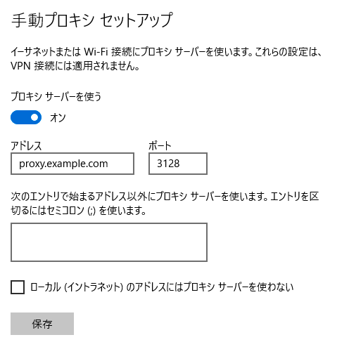

# WorkSpaces

## ディレクトリの作成

以下の手順でディレクトリを作成します。

1. *サービス*から*WorkSpaces*を選択します。
1. *今すぐ始める*をクリックし、*詳細設計*を*起動*します。
1. *ディレクトリのタイプ*は*Simple AD*を選択し、*次へ*進みます。
1. *ディレクトリ情報の入力*で以下の内容を入力し、*次へ*進みます。

  |項目|説明|
  |---|---|
  |ディレクトリのサイズ|スモール|
  |組織名|任意|
  |ディレクトリのDNS名|`corp.example.com`|
  |Adminパスワード|任意|
  |パスワードの確認|任意|

1. *ネットワーキング*で、名前に`WorkSpaces`を含むVPCと`Isolated`を含むサブネットを2つ選択し、*次へ*進みます。
1. 内容を確認し、*ディレクトリの作成*を行います。


1. ディレクトリの*ステータス*列が`Active`になるのを待ちます。

## ディレクトリの登録

1. ディレクトリにチェックし、*アクション*から*登録*をクリックします。
1. *ディレクトリの登録*画面で以下の内容を選択し、*登録*をクリックします。。

  |項目|設定値|備考|
  |---|---|---|
  |サブネット1|Isolatedサブネット||
  |サブネット2|Isolatedサブネット||
  |セルフサービスアクセス許可の有効化|いいえ||
  |Amazon WorkDocs の有効化|いいえ||

1. ディレクトリの*登録済み*列が`はい`になるのを待ちます。

## セキュリティグループの設定

1. ディレクトリにチェックし、*アクション*から*詳細の更新*をクリックします。
1. セキュリティグループを展開し、WorkSpaces用に作成済みのセキュリティグループを選択し、*更新と終了*をクリックします。  

## クライアント証明書の作成

ローカルPC上で、[cfssl](https://github.com/cloudflare/cfssl)を使って、オレオレ認証局と、オレオレ認証局が署名したクライアント証明書を作成します。

```
brew install cfssl
cfssl version
cd certificates
```

### CA

ルートCAの設定ファイルのjsonを作成します。
workspacesというプロファイルを定義し、このCAが署名する証明書の有効期限と、X509v3拡張で証明書に含まれるパブリックキーの用途を指定します。
後でCAから証明書を発行するときにこの設定ファイルとプロファイルを指定します。

```
cat > ca-config.json <<EOF
{
  "signing": {
    "default": {
      "expiry": "8760h"
    },
    "profiles": {
      "workspaces": {
        "usages": ["signing", "key encipherment", "server auth", "client auth"],
        "expiry": "8760h"
      }
    }
  }
}
EOF
```

ルートCAのCSR（証明書署名要求）を作成するためのjsonを作成します。

```
cat > ca-csr.json <<EOF
{
  "CN": "corp.example.com",
  "key": {
    "algo": "rsa",
    "size": 2048
  },
  "names": [
    {
      "C": "JP",
      "O": "Example Company"
    }
  ]
}
EOF
```

CA秘密鍵（ca-key.pem）とCA証明書（ca.pem）を作成します。
このとき証明書署名要求（ca.csr）も作成されます。
前半のcfssl gencertコマンドが秘密鍵とCSRと証明書を作成し、出力されたjsonをcfssljsonコマンドがファイルにしています。

```
cfssl gencert -initca ca-csr.json | cfssljson -bare ca
```

鍵、CSR、証明書の内容を確認します。

```
# 鍵
openssl rsa -text -noout -in ca-key.pem
# CSR
openssl req -text -noout -in ca.csr
# 証明書
openssl x509 -text -noout -in ca.pem
```

### クライアント証明書の作成

設定ファイルを作成します。

```
cat > hogehoge-csr.json <<EOF
{
  "CN": "hogehoge",
  "key": {
    "algo": "rsa",
    "size": 2048
  },
  "names": [
    {
      "C": "JP",
      "O": "Example Company"
    }
  ]
}
EOF
```

秘密鍵と証明書を作成します。

```
cfssl gencert \
  -ca=ca.pem \
  -ca-key=ca-key.pem \
  -config=ca-config.json \
  -profile=workspaces \
  hogehoge-csr.json | cfssljson -bare hogehoge
```

秘密鍵、クライアント証明書、CA証明書をp12形式にまとめます。パスフレーズが聞かれるので設定します。

```
openssl pkcs12 -export -inkey hogehoge-key.pem -in hogehoge.pem -certfile ca.pem -out hogehoge.p12
```

## クライアント証明書認証の設定

1. *サービス*から*WorkSpaces*を選択します。
1. 左のメニューで*ディレクトリ*を選択しします。
1. ディレクトリにチェックし、*アクション*から*詳細の更新*をクリックします。
1. *アクセス制御のオプション*を展開し、以下のように設定します。

  |項目|設定値|備考|
  |---|---|---|
  |Windows および MacOS|許可||
  |信頼された Windows デバイスのみに WorkSpaces へのアクセスを許可|チェックする||
  |信頼された MacOS デバイスのみに WorkSpaces へのアクセスを許可|チェックする||
  |その他のプラットフォーム|ブロック||

1. *ルート証明書1*の*インポート*をクリックします。
1. `ca.pem`の内容をペーストし、*インポート*をクリックします。
1. 内容を確認し、*更新と終了*をクリックします。 


## WorkSpacesの起動

1. 左のメニューで*WorkSpaces*を選択し、*WorkSpacesの起動*をクリックします。
1. *ディレクトリの選択*画面で作成したディレクトリを選択し、*次のステップ*へ進みます。
1. *ユーザーの特定*画面の上部にある*新規ユーザーを作成してディレクトリに追加します*の部分で新規ユーザーの必要事項を入力し、*ユーザーの作成*を行います。
1. 画面下部で作成したユーザーが追加されていることを確認し、*次のステップ*へ進みます。
1. *バンドルの選択*画面では以下を選択し、*次のステップ*へ進みます。

  |項目|設定値|備考|
  |---|---|---|
  |バンドル|Standard with Windows 10 and Office 2016||
  |言語|Japanese||
  
1. *WorkSpacesの設定*画面で以下の内容を選択し、*次のステップ*へ進みます。

  |項目|設定値|備考|
  |---|---|---|
  |実行モード|AutoStop||
  |自分のキーでルートボリューム の暗号化|チェックしない||
  |自分のキーでユーザーボリューム の暗号化|チェックしない||

1. *WorkSpaces のレビューと起動*画面で内容を確認し、*WorkSpacesの起動*を行います。

1. *更新と終了*をクリックします。

## WorkSpacesの利用手順

### クライアント証明書の導入

始めに、ローカルPCにクライアント証明書を導入します。p12ファイルとパスフレーズが管理者から展開されます。

#### Mac

1. Finderで`hogehoge.p12`をダブルクリックします。パスフレーズが聞かれるので入力します。
1. *キーチェーンアクセス*が開くので、*自分の証明書*にインポートされたことを確認します。


1. 左下の分類から、*証明書*を選択し、`corp.example.com`をダブルクリックして開きます。
1. *信頼*を展開し、*この証明書を使用するとき*のドロップダウンで*常に信頼*を選択します。


1. ウインドウを閉じて設定内容を保存します。

### パスワードの設定とクライアントのダウンロード

メールが届くので、リンクをクリックしてパスワードを設定し、クライアントソフトウェアをダウンロードします。

### WorkSpacesへの接続

WorkSpacesクライアントを起動します。

### プロキシサーバーの設定

プロキシサーバーを設定します。

1. スタートボタンをクリックし、その上の歯車のアイコンをクリックします。
1. *Windowsの設定*が開くので、*ネットワークとインターネット*をクリックします。
1. 左のメニューから*プロキシ*をクリックします。
1. *手動プロキシセットアップ*のセクションで、以下の用に設定し、*保存*します。

  |項目|設定値|備考|
  |---|---|---|
  |アドレス|proxy.corp.example.com||
  |ポート|3128||



1. `https://<アカウントID>.signin.aws.amazon.com/console`にアクセスし、アクセスできることを確認します。
